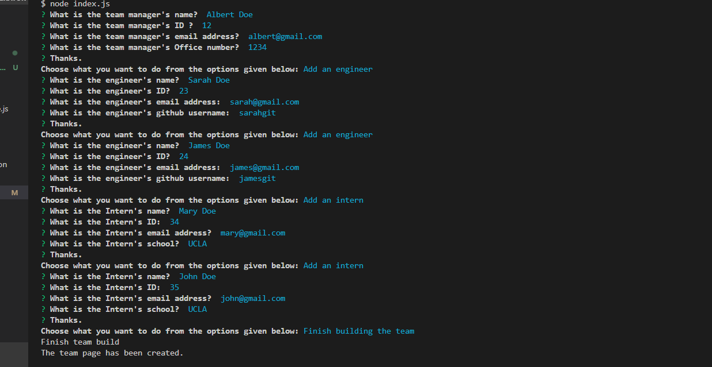
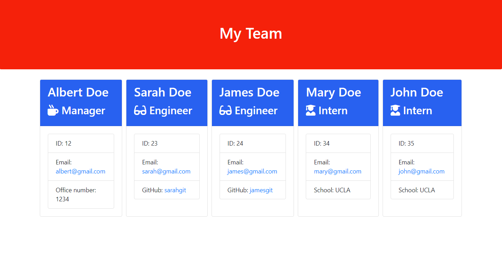

# team-profile-generator
Node.js command-line application that will take in information about employees on a software engineering team, then generates an HTML webpage that displays summaries for each person. 

## Description

This application will build a HTML webpage that displays your team profile. Just answer the prompts that appear in the command line and follow the instructions on screen. Once all questions requiring information about your team are answered, the application will generate a html file showing information about your team (team profile).
GitHub repository of the application:  https://github.com/Pedrobe9/team-profile-generator

## Table of Contents (Optional)

If your README is long, add a table of contents to make it easy for users to find what they need.

- [Installation](#installation)
- [Usage](#usage)
- [License](#license)

## Installation

Type node index.js on the command line.

## Usage

Type node index.js and follow the prompts on the screen requesting information about your tem in order to build the html file with the information of your team. See screenshot below as an example of the rusults.
Image showing the input data process:

Image showng the results of the html file generated:

## License

MIT License

## How to Contribute

N/A so far.
